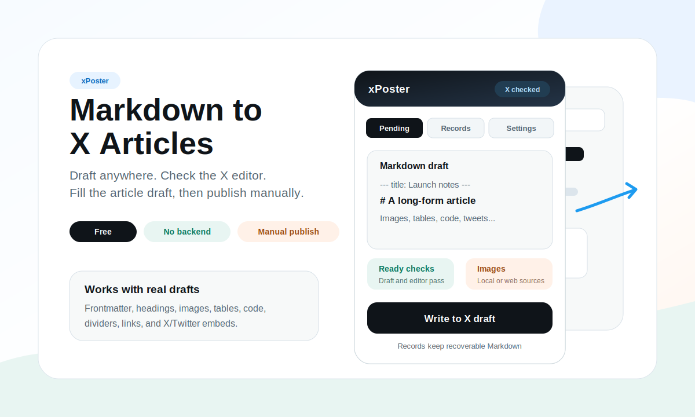
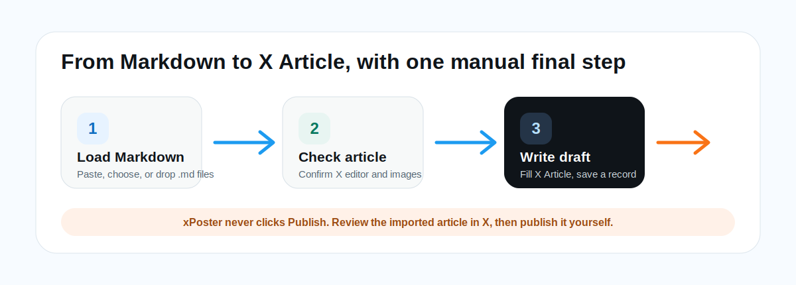

# xPoster

> Write long-form Markdown. Publish it as an X Article without rebuilding the post by hand.
>
> Chrome extension | Markdown to X Articles | images, tables, tweet embeds | batch drafts | local-first

xPoster is a free, open source Chrome extension for writers who draft in Markdown and publish on X. It gives you a staging side panel, checks the live X Article editor, imports your draft, prepares supported media, saves a recoverable record, and leaves the final Publish click to you.

[中文说明](README.zh-CN.md) · [Chrome Web Store](https://chromewebstore.google.com/detail/xposter/iimkimodgdjnnmdopeolboakhjmhfbbj?authuser=0&hl=zh-CN) · [Usage guide](docs/usage.md) · [Privacy](docs/privacy.md)



## Why This Exists

X Articles are useful for long posts, but the editor is not where many people want to draft. If you write in Obsidian, Typora, Notion, VS Code, iA Writer, or any Markdown-first workflow, publishing usually means rebuilding the article by hand:

- copy paragraphs into the editor without breaking the structure
- recreate headings, lists, quotes, links, bold, italic, and inline code
- upload images in the right positions
- turn Markdown tables into something readable in X
- paste tweet URLs as real X embeds
- check whether the active X editor is reachable
- keep a fallback copy when something half-succeeds

xPoster is built for that handoff. Markdown stays your source of truth. X stays the final publishing surface.

## What It Can Do

- **Markdown to X Article**: imports headings, paragraphs, lists, quotes, inline styles, links, code, dividers, images, tables, and X/Twitter embeds into the X Article editor.
- **Single draft or batch queue**: paste one draft, choose a `.md` file, drop one file, or queue multiple Markdown files and write them one by one.
- **Image-aware import**: handles local images near your Markdown file, asks for a local image folder when needed, and can request one-time Chrome permission for web images.
- **Readable tables in X**: renders Markdown tables as images so they do not collapse into unreadable plain text.
- **Title and cover helpers**: can use frontmatter, the first H1, and the first image as article metadata when appropriate.
- **Preflight before writing**: checks the active tab, X Articles page, editor bridge, Draft.js editor, media upload handler, image readiness, and existing editor content.
- **Recoverable records**: keeps local import records so you can search, copy, edit, and write previous Markdown again.
- **Article export tools**: can add subtle Markdown copy/download tools beside readable X Article titles.
- **Diagnostics for breakage**: includes a toolbar diagnostics popup and technical records for debugging X editor changes.
- **Local-first by default**: no backend, account, subscription, license server, payment gate, or analytics.

## Best For / Not For

**Best for**

- writers who draft long-form X posts in Markdown
- creators moving Obsidian, Notion export, blog notes, or local `.md` files into X Articles
- posts with images, tables, code blocks, tweet embeds, and structured sections
- people who publish multiple article drafts and want a queue instead of repeated copy-paste
- maintainers who prefer open source tools they can inspect and modify

**Not for**

- automatic posting or scheduled publishing
- bypassing X limits, moderation, or account restrictions
- X threads, newsletters, or normal tweet composer posts
- perfect WYSIWYG fidelity across every X editor change
- private image hosts unless Chrome can grant the required host access

## 30 Second Start

1. Install [xPoster from the Chrome Web Store](https://chromewebstore.google.com/detail/xposter/iimkimodgdjnnmdopeolboakhjmhfbbj?authuser=0&hl=zh-CN).
2. Open or create an X Article at `https://x.com/compose/articles`.
3. Open the xPoster side panel.
4. Paste Markdown, choose a `.md` file, or drop Markdown files into the panel.
5. Click **Check article**.
6. Click **Write to X draft**.
7. Review the result in X, then publish manually when it looks right.



## What Happens During Import

When you click **Write to X draft**, xPoster does more than paste a wall of text:

1. Parses the Markdown into title, cover candidate, text blocks, images, tables, tweets, code blocks, and dividers.
2. Prepares media that X cannot receive as plain Markdown, including local images, web images, and rendered table images.
3. Confirms the active tab is still the same X Article editor that passed **Check article**.
4. Applies title and cover when the current settings allow it.
5. Writes the article body into X's Draft.js editor.
6. Replaces temporary markers with uploaded images, rendered tables, tweet embeds, code blocks, or dividers.
7. Saves a local record and shows warnings for anything that could not be uploaded or placed.

This is why the extension asks you to run **Check article** first. It is not just a button-state check; it locks onto the real editor before the import starts.

## Example Draft

```md
---
title: How I Write Long Posts for X
cover: ./images/cover.png
---

# How I Write Long Posts for X

I draft in Markdown first, then use xPoster for the final handoff.


| Step | Tool |
| --- | --- |
| Draft | Obsidian |
| Publish | X Articles |

https://x.com/xiaoxiaodong01/status/1234567890
```

In this example, xPoster can use the frontmatter title, try the cover image, upload the body image, render the table as an image, and insert the X status URL as an embed where X supports it.

## Common Workflows

| Task | How xPoster helps |
| --- | --- |
| Publish one polished article | Paste Markdown, check the X editor, write the draft, review in X. |
| Move a local `.md` file with images | Choose the Markdown file, grant the local image folder when prompted, then write to X. |
| Queue several drafts | Drop multiple Markdown files into the side panel and write them one by one. |
| Fix a previous import | Open Records, search the saved Markdown, edit it, and write again. |
| Publish a table-heavy post | Keep the table in Markdown; xPoster renders it as an image for X. |
| Embed tweets inside an article | Put X/Twitter status URLs in the draft; xPoster inserts them as X embeds where supported. |
| Keep a local technical trail | Use the diagnostics and record panels after Check or Write runs. |
| Copy an existing X Article back to Markdown | Enable article export tools and use the title-side copy/download buttons on readable article pages. |

## Markdown And Media Support

| Input | Behavior |
| --- | --- |
| `--- title: My title ---` | Uses frontmatter title when possible. |
| `# Heading` | Uses the first H1 as title when no frontmatter title is available. |
| Paragraphs, headings, lists, quotes | Converts them into X Article rich text. |
| `**bold**`, `*italic*`, `` `code` ``, links | Preserves inline formatting where X accepts it. |
| `` | Uploads supported local or web images when xPoster can read the file. |
| `cover:` frontmatter or first image | Can set article cover when the setting is enabled. |
| Markdown tables | Renders tables as images for stable X display. |
| X/Twitter status URLs | Inserts tweet embed blocks through X's editor model where supported. |
| Code fences and dividers | Imports them as supported X Article blocks. |

A smoke-test draft is included at [fixtures/live-x-smoke.md](fixtures/live-x-smoke.md).

## Prepare Markdown Without The X API

If you want to use the Chrome extension flow but clean up Markdown first, run
the local preparation mode:

```bash
node scripts/upload-x-article.js article.md \
  --prepare-markdown \
  --base-url https://example.com/blog/post/ \
  --output article.xposter.md
```

This does not contact X, does not need OAuth, and does not create a draft. It
writes Markdown you can paste into xPoster or load as a `.md` file. Use
`--base-url` when the source Markdown has relative links or images that should
become public absolute URLs. Add `--h3-as-bold` if third-level headings should
become bold paragraphs for X Article rendering.

Omit `--output` to print the prepared Markdown to stdout. On macOS, you can copy
it directly with:

```bash
node scripts/upload-x-article.js article.md --prepare-markdown | pbcopy
```

## Images

**Local images**: keep image files near your Markdown file and choose the matching local image folder when xPoster asks. Relative paths like `./images/photo.png` work only after Chrome grants xPoster access to that folder.

**Web images**: Chrome may ask for one-time permission to read the image host. xPoster needs the image bytes so it can pass the file to X's uploader. Failed downloads stay as Markdown links instead of silently disappearing.

**Private hosts**: the public source build does not expose private image hosts. If you maintain a fork and need fixed remote image support, declare only the trusted hosts in your own extension manifest.

## Reliability And Recovery

xPoster is built around the assumption that browser automation can fail: X can change its editor, a file can be missing, a web image can be blocked, or an upload can stall. The extension tries to make those failures visible and recoverable:

- **Before import**: preflight checks whether the page, editor bridge, Draft.js editor, media upload path, and current draft state are usable.
- **During import**: progress messages show which phase is running, such as parsing, preparing media, setting metadata, writing text, uploading media, or placing embeds.
- **After import**: warnings tell you which images, tables, or cover assets were kept as Markdown instead of uploaded.
- **For retrying**: Records keep the original Markdown locally, so you can copy, edit, or write the same draft again from a clean X Article.
- **For debugging**: the diagnostics popup and evidence records give maintainers enough context to investigate editor changes without guessing.

The safest habit is simple: run **Check article**, write into a clean X Article draft, review the result in X, and publish only after you are satisfied.

## Why xPoster Works This Way

- **It writes into the real X editor** instead of pretending to be a publishing API. That keeps the final review and publish step inside X.
- **It checks before it writes** because X changes its editor often. A preflight failure is better than a half-written article.
- **It saves records locally** because browser automation can fail halfway through media, embeds, or editor state changes.
- **It does not click Publish** because the extension should help with formatting and transfer, not make the final editorial decision.
- **It stays dependency-light** so the extension remains inspectable and easy to audit.

## Install From Source

Use the Web Store build unless you want to inspect, test, or modify the extension yourself.


1. Download or clone this project.
2. Open Chrome and go to `chrome://extensions`.
3. Turn on **Developer mode**.
4. Click **Load unpacked**.
5. Select the xPoster project folder, the folder that contains `manifest.json`.

## Privacy And Safety

- Drafts and import records are stored in your browser's local extension storage.
- xPoster runs on `x.com` and `twitter.com` because it needs to fill the X Article editor and read article pages for optional Markdown export.
- xPoster asks for `tabs` only to find and check the active X Article tab.
- Optional host permissions are requested only when a draft uses web images that need to be downloaded.
- xPoster does not include analytics, a backend service, a license server, or a payment gate.
- xPoster does not click Publish. You always review and publish manually in X.

Read the shorter privacy note in [docs/privacy.md](docs/privacy.md).

## Developer Checks

This project is dependency-light. Node is only used for local verification.

```bash
npm run check
npm test
npm run verify
```

`npm run check` verifies JavaScript syntax, `manifest.json`, and i18n coverage.

`npm test` verifies the fixture, manifest references, icons, and Markdown parsing behavior.

## Project Layout

```text
manifest.json          Chrome extension manifest
sidepanel.html         Main side panel UI
sidepanel.css          Side panel styling
sidepanel.js           Side panel workflow, records, queue, and import controls
diagnostics.html       Toolbar popup for active-tab checks
diagnostics.js         Diagnostics UI logic
src/background.js      MV3 service worker and image fetch proxy
src/content.js         X page content script, page status, and Markdown export
src/main-world.js      MAIN-world Draft.js / X editor adapter
src/shared.js          Markdown parser, paste plan, local image helpers
fixtures/              Example Markdown used by checks and demos
docs/                  Usage guide, images, privacy notes
scripts/               Local verification scripts
```

## FAQ

**I cannot see xPoster in Chrome.**
Install the Web Store version, or enable Developer mode and load the source folder that contains `manifest.json`.

**Write to X draft is disabled.**
Load or edit a Markdown draft first, open an X Article tab, then click **Check article**.

**Images stay as links.**
Local images need a selected image folder. Web images need to be downloadable after Chrome grants the image-site permission.

**The imported article looks wrong.**
Do not publish yet. Edit directly in X, or reset the draft and retry from the saved Markdown record.

**X changed its editor and import stopped working.**
Open an issue with your Chrome version, xPoster version, and the diagnostics JSON from the toolbar popup.

## Contributing

Issues and pull requests are welcome. Start with [CONTRIBUTING.md](CONTRIBUTING.md).

## Support

xPoster is free and open source. If it saves you time and you want to support ongoing maintenance, you can scan the Buy Me a Coffee QR code below. This is optional; feedback, issues, and stars also help.


## Contact

Contact the author on X: [@xiaoxiaodong01](https://x.com/xiaoxiaodong01).

## License

MIT. See [LICENSE](LICENSE).
